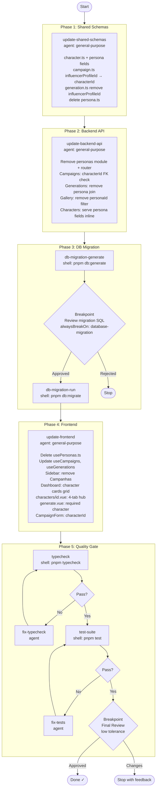

# Character-Centric Redesign — Process Flow



## Phase Summary

| Phase | Kind | Description |
|-------|------|-------------|
| update-shared-schemas | agent | Update `@lumora/shared` Zod schemas — persona fields on character, characterId on campaign, remove influencerProfileId from generation, delete persona.ts |
| update-backend-api | agent | Remove `personas` module, update campaign/generation/gallery routes and repos to use characterId |
| db-migration-generate | shell | `pnpm db:generate` — creates migration from current Drizzle schema |
| **BREAKPOINT** | human | Review migration SQL before running (alwaysBreakOn: database-migration) |
| db-migration-run | shell | `pnpm db:migrate` — applies migration |
| update-frontend | agent | Remove Campanhas from sidebar, character-hub 4-tab page, dashboard cards, composables cleanup |
| typecheck | shell | `pnpm typecheck` — all packages green |
| fix-typecheck (if needed) | agent | Fix any TS errors from the migration |
| test-suite | shell | `pnpm test` — all 109 tests pass |
| fix-tests (if needed) | agent | Fix any test failures from schema changes |
| **BREAKPOINT** | human | Final review before closing run |
```
